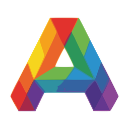
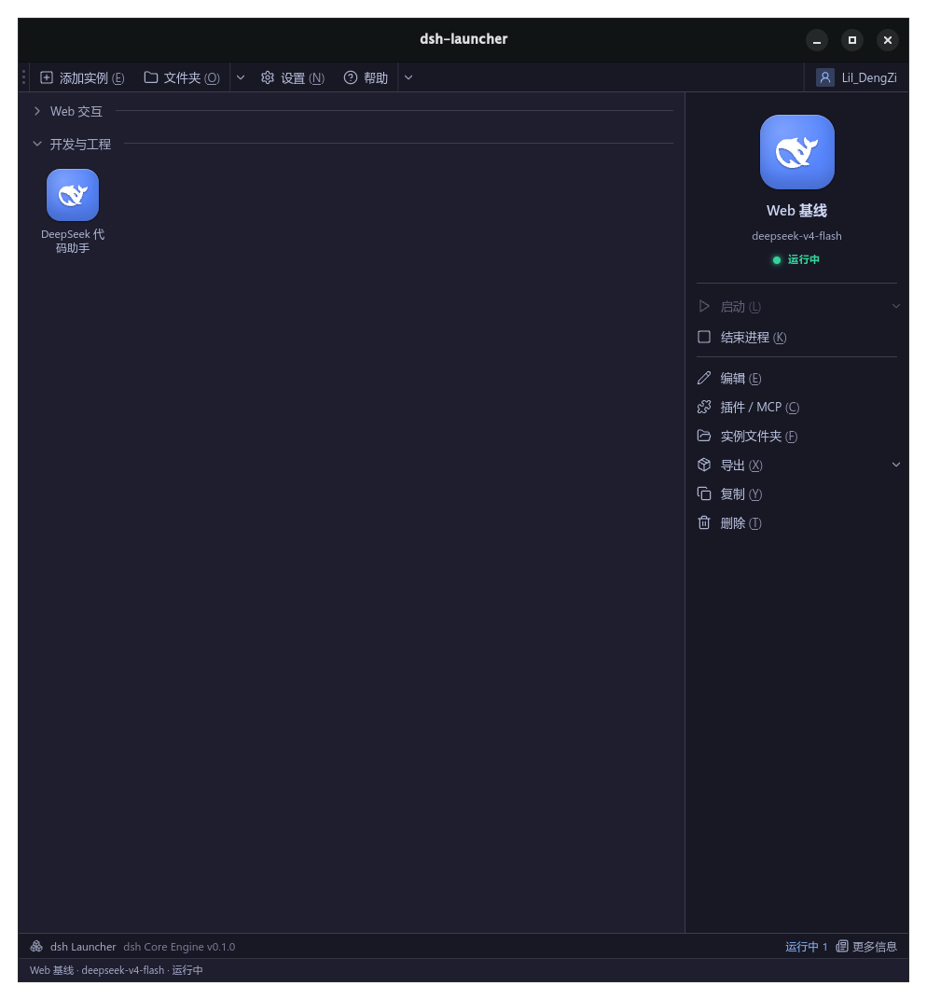
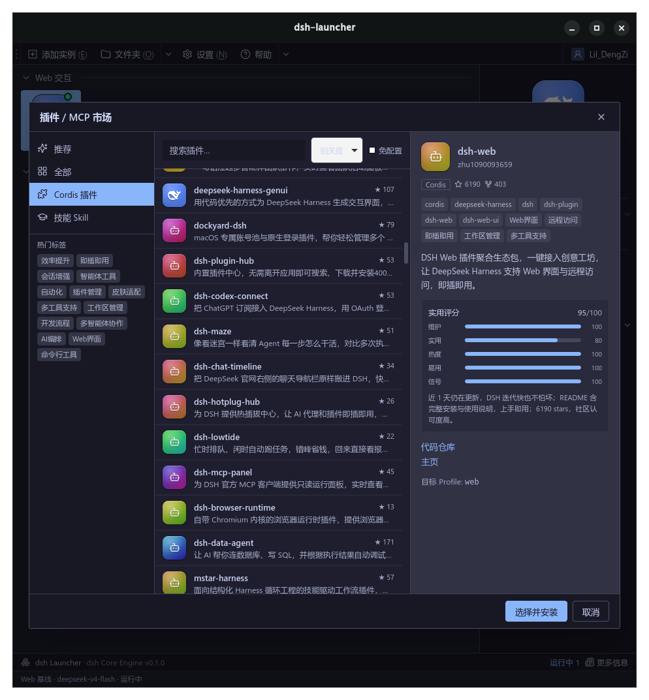
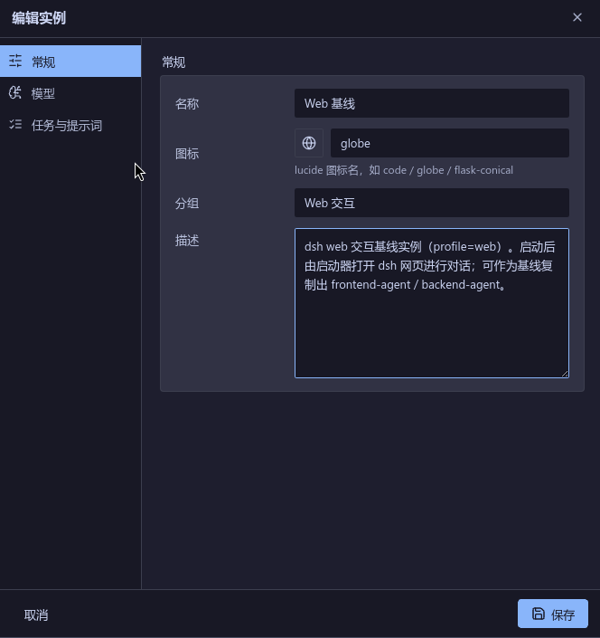

<div align="center">



# agentLauncher

**Manage AI agents the way Prism Launcher manages Minecraft instances.**

[](LICENSE)
[](https://tauri.app)
[](https://vuejs.org)
[](https://www.rust-lang.org)
[](https://github.com/lildengzi/agentLauncher/releases)
[](https://github.com/lildengzi/agentLauncher/releases)
[](https://github.com/lildengzi/agentLauncher/actions)
[](CONTRIBUTING.md)


**[中文](README_zh.md)**

</div>

---

## 📸 Screenshots

| Dashboard | Plugin Hub | Edit Instance |
|-----------|------------|---------------|
|  |  |  |
| Grid cards, action panel, status bar | Search, tags, scored picks | General, model, prompt |

---

> Six engines, a whole shelf of agents.

`agentLauncher` is a graphical launcher for AI agents, built on **Prism Launcher's isolation philosophy**. It treats each agent as an isolated *instance* — its own sandboxed directory, model, plugins and keys — and runs it with a single **Launch**. One `runtime.engine` per instance picks the CLI: `dsh` · `pi` · `omp` · `claude` · `codex` · `opencode`.

It only **manages**; it never intercepts the chat: `dsh` web instances interact in **dsh's own web page**, the other five engines run as headless one-shots — the launcher is just the hand that starts whichever CLI you picked (see [Architecture](docs/wiki/Architecture.md)).

### ✨ Highlights

| | Feature | What it does |
|---|---|---|
| 🧱 | **Sandboxed instances** | Each agent gets its own directory; `workspace/` is the safe root it reads and writes within. |
| 🔐 | **Per-instance keys & .env** | Keys are injected per instance and never reach the UI; the credentials file stays `0600`. Local-first. |
| 🧩 | **Plugin Hub** | Browse, search and get tag-based recommendations — pick capabilities per instance, modpack-style. |
| 🌐 | **Launch to the web UI** | Web instances auto-start the server, grab a port and open the browser — you chat in dsh's own page. |
| 📜 | **Read-only log view** | Streaming stdout flows into a read-only log page for reviewing tool calls and reasoning. |
| 🌱 | **Clone from baseline** | Tune one baseline, then clone it into front-end / back-end / batch agents — just swap profile and model. |

### 🧩 Anatomy of an instance

One agent = one directory. No hidden global state — open the folder and you see everything that agent is:

```text
~/.agentlauncher/instances/web-baseline/
├─ instance.json   # metadata: name · icon · group · profile · runtime.engine · model ...
├─ AGENTS.md       # this instance's system prompt & rules
├─ mcp.json        # enabled MCP (Model Context Protocol) plugins
├─ .env            # this instance's API keys & env vars (isolated injection)
├─ skills/         # mounted skill packs
├─ workspace/      # safe file sandbox root (session history settles here too)
└─ logs/           # output & token-usage audit
```

### 🚀 Quick start

**Prereqs**: Rust toolchain · Node + pnpm · the [DeepSeek Harness (`dsh`) CLI](https://github.com/deepseek-ai) (on your `PATH`, with `DEEPSEEK_API_KEY` set).

```bash
pnpm install          # install frontend deps
pnpm tauri dev        # dev mode, opens the desktop window
pnpm tauri build      # bundle the desktop app
```

1. **Install dsh first** — the launcher is only a shell; DeepSeek Harness does the work.
2. **Create an instance** — hit *Add instance*, pick the web profile and a model; the folder is created under `~/.agentlauncher/`.
3. **Launch & chat** — press *Launch*; the browser opens dsh's web page. History stays in the instance's `workspace/`.

> 📄 A GitHub-Pages-ready landing page ships in the repo: [`docs/landing.html`](docs/landing.html).

### 🏗 How it works

A light shell that runs **any of six agent CLIs**. **Tauri 2 (Rust)** manages subprocesses, the file sandbox and credentials; the six `AgentRuntime` adapters — `dsh` · `pi` · `omp` · `claude` · `codex` · `opencode` — all live in `src-tauri/src/runtime/model.rs:1` and are dispatched by `runtime::for_instance` (`src-tauri/src/runtime/mod.rs:71`). `dsh` is the only engine with a web serve mode; the other five run as headless one-shots.

- **Run shape is derived from the engine + profile**: `dsh` web-capable profiles (bundles include `@deepseek-ai/dsh-web-app`) start a server, grab a port and open the browser; everything else runs a one-shot task (`-p` / `exec` / `run` depending on the engine, see [Instance Anatomy](docs/wiki/Instance-Anatomy.md#自由组合--框架--llm)).
- **Front/back contract**: `src/types.ts` mirrors the Rust structs; `src/lib/api.ts` wraps every `invoke` command and the `dsh-log` / `dsh-status` events.

### 🙏 Acknowledgements

- **[Prism Launcher](https://prismlauncher.org/)** — inspiration for the instance-isolation philosophy and UI layout.
- **DeepSeek Harness (`dsh`) · pi · omp · Claude Code · Codex · opencode** — six supported CLIs (`src-tauri/src/runtime/model.rs:22`); `dsh` is first-class with web UI.

> ⚠️ The UI is heavily inspired by Prism Launcher, but agentLauncher is an **independent project**, not affiliated with Prism Launcher, Mojang, or DeepSeek.

### 🤝 Contributing

See [CONTRIBUTING.md](CONTRIBUTING.md) for dev setup and PR guidelines. Bug reports and feature requests via [Issues](https://github.com/lildengzi/agentLauncher/issues) (templates provided).

### 📄 License

[MIT](LICENSE) © 2026 lildengzi