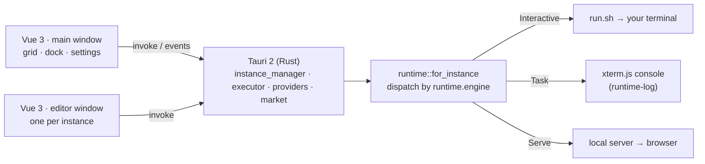

<div align="center">


# agentLauncher

**A universal launcher for isolated AI agent instances.**

[](LICENSE)
[](https://tauri.app)
[](https://vuejs.org)
[](https://www.rust-lang.org)
[](#-platform-support)
[](https://github.com/lildengzi/agentLauncher/releases)
[](https://github.com/lildengzi/agentLauncher/actions)
[](CONTRIBUTING.md)


**[中文](README_zh.md)**

</div>

---

> One launcher, a whole shelf of agents.

`agentLauncher` is a desktop launcher for agent CLIs, built on **Prism Launcher's isolation
philosophy**: every agent is an *instance* — its own directory, model, keys, skills, MCP servers
and system prompt — and a single **Launch** starts it.

The launcher never intercepts the conversation. It probes your `PATH`, resolves credentials,
writes the per-run config, and hands off to the CLI you picked. Six engines ship as adapters
today: `dsh` · `pi` · `omp` · `claude` · `codex` · `opencode`.

## 📸 Screenshots

| Dashboard | Market | Edit instance |
|-----------|--------|---------------|
|  |  |  |
| Grouped icon grid, right action dock, status bar | Plugins · skills · MCP from your own source list | Eight sections, its own OS window |

> ⚠️ These shots are from `v0.1.0`. The UI has since been repainted (Prism Void) and the plugin
> hub replaced by a per-instance market dialog — a refresh is pending.

## ✨ Highlights

| | Feature | What it does |
|---|---|---|
| 🧱 | **One agent = one directory** | Model, prompt, keys, skills, MCP servers, workspace and logs all live under `~/.agentlauncher/instances/<id>/`. No hidden global state. |
| 🖥 | **Interactive sessions in your own terminal** | The default for five of the six engines: the launcher writes a `run.sh` and opens your terminal emulator, so you talk to the CLI in the place you already know. |
| 📜 | **Task runs stream into the app** | One-shot runs pipe stdout/stderr into an xterm.js console with the stop button next to it. |
| 🌐 | **Web instances open the browser** | A web-capable `dsh` profile starts a server on a free port; the launcher watches for the URL and opens it. |
| 🔐 | **Three-layer credentials** | The engine's own config → the launcher's shared key store → the instance's `.env`. Key values never reach the UI; only fingerprints do. |
| 🧰 | **A provider store that fills itself** | Pull a live model list from any OpenAI-compatible endpoint, probe local runtimes (Ollama · LM Studio · vLLM · llama.cpp), or import providers and keys from agents you already have installed. |
| 🛒 | **Decentralized market** | Plugins, skills and MCP servers come from a source list *you* edit — HTTP feeds, the MCP Registry, or a local drop-in directory — fetched, normalized and cached in Rust. |
| 🪟 | **One editor window per instance** | Eight sections in its own OS window, so two agents can be configured side by side. |
| 🎨 | **13 themes, bilingual UI** | Prism Void by default, plus Catppuccin ×4, Dracula, Nord, Tokyo Night, Gruvbox, Solarized, One Dark, Rosé Pine and GitHub Light. Chinese / English, Alt-key mnemonics throughout. |

## 🤖 Supported engines

Detected live on your `PATH` — never a disk scan, and the binary is never executed to probe it.
Missing engines are still listed, greyed out, so you can see *why* one is unavailable.

| Engine | `runtime.engine` | Provider selection | Web serve | Default run mode |
|---|---|---|---|---|
| dsh (DeepSeek Harness) | `dsh` | a route in the generated `model.patch.yml` | ✅ | Task |
| pi (pi-coding-agent) | `pi` | `--provider` / `--model` | — | Interactive |
| omp (oh-my-pi) | `omp` | `--provider` / `--model` | — | Interactive |
| Claude Code | `claude` | none — `ANTHROPIC_*` env only | — | Interactive |
| Codex | `codex` | `-c model_provider=` / `-c model=` | — | Interactive |
| opencode | `opencode` | `-m <provider>/<model>` | — | Interactive |

**How the run mode is decided** (`src-tauri/src/runtime/mod.rs`):

1. A `dsh` profile whose `package.json` lists `@deepseek-ai/dsh-web-app` in `dsh.profile.bundles` → **Serve**.
2. Otherwise an explicit `runtime.mode`: `task` → **Task**, `interactive` → **Interactive**.
3. Otherwise the engine's own default — the last column above.

Adding an engine is one `impl AgentRuntime` plus a row in the catalog. The executor does not change.

## 🧩 Anatomy of an instance

One agent = one directory. Open the folder and you see everything that agent is:

```text
~/.agentlauncher/instances/web-baseline/
├─ instance.json      # name · icon · group · provider · model · api_key_ref · runtime{engine,mode,env_policy,custom_bin} · profile
├─ AGENTS.md          # this instance's system prompt & rules — editable in the UI
├─ mcp.json           # its MCP (Model Context Protocol) servers — editable in the UI
├─ .env               # its own API keys & env vars (0600 once written through the UI)
├─ skills/            # skill packs mounted into this instance only
├─ workspace/         # the safe file sandbox root; session history settles here
├─ logs/              # output & token-usage audit
├─ model.patch.yml    # generated per dsh launch that names a model
└─ run.sh             # generated per interactive launch (0700) — this run's env, incl. the resolved key
```

`workspace/` has a stable path, which is what makes history and memory carry over between launches.
The two generated files are rewritten on every launch; `run.sh` is never returned to the frontend —
only its path appears in one console line.

## 🗄 The launcher's own directory

Instances are not the only state on disk. The root is `0700`:

```text
~/.agentlauncher/
├─ config.json        # theme · locale · default provider/model · last selection
├─ instgroups.json    # sidebar overlay: group order, collapse state, intra-group order
├─ providers.json     # the shared key store (0600) — providers, base URLs, model lists, aliased keys
├─ sources.json       # market source list
├─ sources/           # drop-in directory read by the built-in `local` source
├─ cache/market/      # normalized feed cache, so the market dialog opens offline
└─ instances/         # one directory per instance
```

Group *membership* lives on the instance; `instgroups.json` only carries order and collapse state,
so a hand-edited `instance.json` can never be orphaned by the overlay.

## 🔐 Credentials

Each instance picks one of three layers in its **Model** page (`密钥存放` / *Key storage*), and the
executor resolves them in this order at launch:

1. **`instance`** — `instances/<id>/.env`, written `0600`, that instance only.
2. **`shared`** — the launcher's own store, `~/.agentlauncher/providers.json` (`0600`). A provider
   can hold several aliased keys; `api_key_ref` either pins one (`<provider>/<alias>`) or
   round-robins over the enabled ones (`<provider>`).
3. **`system`** — the engine's own configuration, untouched. For `dsh` that is
   `~/.dsh/.credentials.yaml` (`0600`).

Invariants the code holds, not just intends:

- **No command returns a plaintext key.** The frontend receives `{alias, enabled, fingerprint, has_value}`;
  the fingerprint is first-4 + `…` + last-4, or eight bullets for short values. The 👁 toggle switches
  fingerprint ↔ dots — there is nothing else to reveal.
- `set_provider_key` is the only inbound path a secret takes to disk. Renaming an alias deliberately
  drops its value rather than silently re-binding it.
- Model fetching (`fetch_provider_models`) reads the key from disk **inside the backend**, requires
  `https` unless the host is loopback, follows no redirects, and is only ever user-triggered per provider.
- Provider adoption reads other agents' configs (`omp`, `pi`, `opencode`, `codex`, `dsh`) but reports
  only `has_key: bool`; importing moves values disk-to-disk and returns a count.
- Console lines print variable **names**, never values.

## 🛒 Market & sources

There is no central hub. `sources.json` is a list you edit in **Settings ▸ Data sources**, and three
rows ship built in: the `dsh.market` HTTP feed (plugins + skills), a `local` directory
(`~/.agentlauncher/sources`, all three kinds), and the [MCP Registry](https://registry.modelcontextprotocol.io).

Fetching, normalizing, caching and installing all happen in Rust: a scheme allowlist with a
redirect re-check, timeouts and a response byte cap, then a per-source adapter that turns whatever
the feed shaped into one `MarketItem` vocabulary, cached on disk so the dialog opens offline and
reports per-source status and staleness. Installs route to `pnpm-profile`, `git-clone` or
`mcp-config`; anything else degrades to a copy-the-command manual path rather than a button that
would fail.

Feed content is third-party text and is treated as such: rendered as text (never `v-html`), links
opened only through the backend's URL opener, required env vars shown by **name** only.

## 🚀 Quick start

**Prereqs**: Rust stable · Node ≥ 22.13 + pnpm 11 (what CI pins) · **at least one agent CLI on your
`PATH`** — any of `dsh` · `pi` · `omp` · `claude` · `codex` · `opencode`.

```bash
pnpm install                 # frontend deps
pnpm tauri dev               # dev mode, opens the desktop window
pnpm build                   # vue-tsc --noEmit && vite build
pnpm tauri build             # bundle the desktop app
cd src-tauri && cargo test   # backend tests (18 modules ship them)
```

> 📦 Everything this README describes ships in **`v0.2.0`** — grab a prebuilt package from
> [Releases](https://github.com/lildengzi/agentLauncher/releases) (deb · rpm · AppImage · pacman ·
> dmg · msi · nsis, x86_64 and aarch64) or build from source with the commands above. The older
> `v0.1.0` binaries predate the market, the per-instance editor windows, the provider key store and
> interactive sessions.

1. **Install at least one engine.** The launcher is a shell; the CLI you pick does the work.
2. **Add an instance.** Pick a model in the upper table and an Agent in the lower one; the run-mode
   column on the right doubles as a filter (choose *Web* and only web-capable engines remain). The
   folder appears under `~/.agentlauncher/instances/`.
3. **Give it a key** — Settings ▸ Model & API for the shared store, or the instance editor's Model
   page for a private one. Local runtimes (Ollama et al.) need none.
4. **Launch.** Interactive opens your terminal; a task streams into the console; a web profile opens
   the browser. History stays in that instance's `workspace/`.

> 📄 A GitHub-Pages-ready landing page ships in the repo: [`docs/landing.html`](docs/landing.html).

## 🖥 Platform support

| | Build & run | Task / Web instances | Interactive sessions |
|---|---|---|---|
| **Linux** | ✅ | ✅ | ✅ |
| **macOS** | ✅ | ✅ | ❌ not wired yet |
| **Windows** | ✅ | ✅ | ❌ not wired yet |

Interactive mode spawns a terminal emulator, and the discovery list is currently Linux-only:
`$TERMINAL` first, then the first installed of kitty · foot · alacritty · wezterm · ghostty · konsole ·
gnome-terminal · xfce4-terminal · terminator · tilix · urxvt · st · xterm and friends. Since
Interactive is the *default* for five of six engines, on macOS and Windows set `runtime.mode` to
`task` (or use a `dsh` web profile) until that gap closes.

## 🏗 How it works

A light shell around **any** agent CLI. **Tauri 2 (Rust)** owns subprocesses, the file sandbox,
credentials and every network call; **Vue 3** owns two windows and nothing else.



- **Two windows.** The launcher is `index.html`; each instance's editor is a separate OS window
  (`edit.html`, label `edit-<id>`) — asking for one that already exists focuses it instead of opening
  a second. Only the main window persists `config.json`; editor windows read it. The main window
  re-reads the instance list on focus, because editors write `instance.json` behind its back.
- **Engine adapters** live in `src-tauri/src/runtime/model.rs` behind the `AgentRuntime` trait, with
  the catalog in `engines.rs`, the child-`PATH` policy in `runtime/env.rs`, terminal discovery and
  `run.sh` generation in `runtime/term.rs`, and dsh's `$DSH_HOME` reader in `runtime/dsh_home.rs`.
  `runtime/model_test.rs` pins the argv matrix for all six engines in both shapes.
- **Front/back contract.** `src/types.ts` mirrors the Rust structs; `src/lib/api.ts` wraps all 45
  `invoke` commands and the three events — `runtime-log`, `runtime-status`, `open-settings`.
- **The instance editor** has eight sections: General · Model · Runtime · Plugins · Skills · MCP ·
  AGENTS.md · Task. Plugins are honest about scope — for `dsh` they are the profile's pnpm deps and
  therefore *shared*, and engines without plugin support say so instead of showing an empty list.
- **Settings** implements Appearance, General, Model & API, Data sources and About; Accounts, Remote
  services, Tools and Proxy are listed as planned rather than hidden.

## ⚠️ Known limitations

- Interactive sessions are Linux-only (see [Platform support](#-platform-support)).
- A freshly scaffolded instance `.env` is created at the default umask; it becomes `0600` once a key
  is written through the UI.
- **Export instance** and the toolbar's **Account** button are deliberate placeholders.
- CI runs `pnpm build`, `cargo check`, `clippy` and `cargo fmt`, but **not** `cargo test` — run it
  locally. There is no frontend test framework and no ESLint config yet.
- There is no historical log viewer: `logs/` accumulates, but the console only shows the live run.

## 🗺 Roadmap

- [x] Prism-style launcher: grouped icon grid, right action dock, status bar, Alt mnemonics
- [x] Six engines detected live on `PATH`; run mode derived from engine + profile
- [x] Interactive sessions in your own terminal; task runs streamed into the app
- [x] Web instances launched straight into the browser
- [x] A per-instance editor window with all eight sections
- [x] App-level provider & key store, live model lists, local-runtime probe, key adoption
- [x] Decentralized market sources with a disk cache and real installs
- [x] 13 themes, Chinese / English
- [ ] Interactive sessions on macOS and Windows
- [ ] Instance import / export (recipes)
- [ ] Accounts · Remote services · Tools · Proxy settings pages
- [ ] Historical session / log browser

## 📚 Docs

[Home](docs/wiki/Home.md) · [Getting started](docs/wiki/Getting-Started.md) ·
[Architecture](docs/wiki/Architecture.md) · [Configuration](docs/wiki/Configuration.md) ·
[Instance anatomy](docs/wiki/Instance-Anatomy.md) · [Launcher anatomy](docs/wiki/Launcher-Anatomy.md) ·
[FAQ](docs/wiki/FAQ.md)

These pages are mirrored to the [GitHub Wiki](https://github.com/lildengzi/agentLauncher/wiki) by CI
whenever `docs/wiki/**` changes.

## 🙏 Acknowledgements

Instance isolation and the whole UI layout are modelled on [Prism Launcher](https://prismlauncher.org/);
agentLauncher is an independent project, not affiliated with Prism Launcher, Mojang, Anthropic,
OpenAI or DeepSeek. Brand marks come from [simple-icons](https://simpleicons.org), glyphs from
[Lucide](https://lucide.dev), and the in-app console is [xterm.js](https://xtermjs.org).

## 🤝 Contributing

See [CONTRIBUTING.md](CONTRIBUTING.md) for dev setup and PR guidelines. Bug reports and feature
requests via [Issues](https://github.com/lildengzi/agentLauncher/issues) (templates provided).

## 📄 License

[MIT](LICENSE) © 2026 lildengzi
