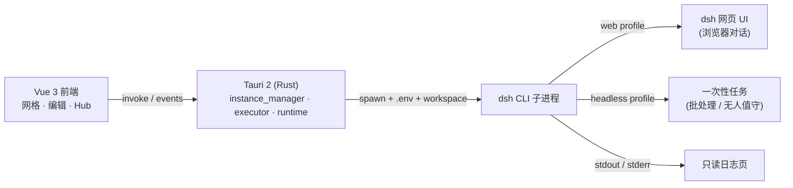

<div align="center">

# 🔷 agentLauncher

**像 Prism Launcher 管理 Minecraft 实例一样，管理你的 AI Agent。**

[](https://tauri.app)
[](https://vuejs.org)
[](https://www.rust-lang.org)
[-5b9dff)](docs/wiki/Architecture.md)


**[English](README.md)**

</div>

---

## 📸 界面一览

| 实例面板 | 插件 Hub | 编辑实例 |
|----------|----------|----------|
|  |  |  |
| 网格卡片 / 右侧操作面板 / 状态栏 | 搜索 · 标签 · 评分推荐 | 常规 / 模型 / 提示词 |

---

> 一个引擎，一整排专属 Agent。

`agentLauncher` 是一个基于 **Prism Launcher 隔离哲学** 的 AI Agent 图形化启动器。它把每个 Agent 当成一个独立、隔离的「实例」来管理 —— 各自拥有独立的沙箱目录、模型、插件与密钥 —— 然后像点「启动」一样把它跑起来。

它只做**管理**，不插手对话：交互发生在 **dsh 自己的网页** 里。

### ✨ 亮点

| | 能力 | 说明 |
|---|---|---|
| 🧱 | **实例隔离沙箱** | 每个 Agent 一个独立目录，`workspace/` 是它读写文件的安全根，互不越界。 |
| 🔐 | **独立凭据与 .env** | 密钥按实例隔离注入，永不进入前端；凭据文件保持 `0600`，本地优先。 |
| 🧩 | **插件 Hub** | 像逛整合包一样浏览、搜索、按标签推荐插件，为每个实例挑选能力。 |
| 🌐 | **一键启动到网页** | Web 实例自动起服务、抓端口、开浏览器，你在 dsh 自己的页面里对话。 |
| 📜 | **只读日志排障** | 流式 stdout 汇入只读日志页，方便回看工具调用与思维链，不抢对话。 |
| 🌱 | **基线克隆** | 调好一个基线，复制成前端 / 后端 / 批处理 Agent —— 只改 profile 与模型。 |

### 🧩 一个实例的解剖

一个 Agent = 一个目录。没有隐藏的全局状态，打开文件夹你看到的就是这个 Agent 的全部：

```text
~/.dsh-launcher/instances/web-baseline/
├─ instance.json   # 元数据：名称 · 图标 · 分组 · 模型 · temperature · thinking_budget
├─ AGENTS.md       # 该实例专属的 System Prompt 与行为守则
├─ mcp.json        # 启用的 MCP (Model Context Protocol) 插件配置
├─ .env            # 该实例专属的 API Keys 与环境变量（隔离注入）
├─ skills/         # 挂载的独立 Skill 工具包目录
├─ workspace/      # Agent 读写文件的安全沙箱根（会话历史也沉淀于此）
└─ logs/           # 历史输出与 Token 消耗审计日志
```

> `workspace/` 路径稳定，意味着会话历史与记忆天然沉淀在这里，跨次启动继续继承。

### 🚀 快速开始

**前置**：Rust 工具链 · Node + pnpm · [DeepSeek Harness (`dsh`) CLI](https://github.com/deepseek-ai)（需在 `PATH` 中，并配好 `DEEPSEEK_API_KEY`）。

```bash
pnpm install          # 安装前端依赖
pnpm tauri dev        # 开发模式，拉起桌面窗口
pnpm tauri build      # 打包桌面应用
```

1. **先装 dsh** —— 启动器只是外壳，真正干活的是 DeepSeek Harness。
2. **新建实例** —— 点「添加实例」，选 web profile 与模型，实例文件夹在 `~/.dsh-launcher/` 下生成。
3. **启动并对话** —— 按「启动」，浏览器自动打开 dsh 网页；历史留在该实例的 `workspace/` 里。

> 📄 仓库内附带一份可直接用 GitHub Pages 托管的落地页：[`docs/landing.html`](docs/landing.html)。

### 🏗 架构 / How it works

轻量外壳，把引擎跑起来。**Tauri 2（Rust）** 负责管理子进程、文件沙箱与凭据；**DeepSeek Harness（`dsh` CLI）** 才是真正的执行引擎。启动器只是那只手。



- **运行形态由 profile 自动推导**：profile 的 `bundles` 含 `@deepseek-ai/dsh-web-app` → 起 web 服务、抓端口、开浏览器；否则跑一次性任务。
- **前后端契约**：`src/types.ts` 镜像 Rust 结构体，`src/lib/api.ts` 封装所有 `invoke` 命令与 `dsh-log` / `dsh-status` 事件。

### 🗺 路线图

- [x] 实例面板：网格卡片 / 分组 / 右侧操作面板 / 状态栏
- [x] 新建 / 编辑实例，真实拉起 dsh 并流式日志
- [x] Web 实例一键启动到 dsh 网页（运行形态从 profile 派生）
- [x] 插件 Hub：浏览 / 搜索 / 标签推荐
- [ ] Hub 内一键安装 / 卸载插件
- [ ] Headless 批处理 / 无人值守通道（已设计，暂缓）
- [ ] 实例导入 / 导出（recipe 配方）

### 🙏 致谢

- **[Prism Launcher](https://prismlauncher.org/)** —— 实例隔离哲学与界面布局的灵感来源（网格卡片、右侧面板、Hub 模态框）。
- **DeepSeek Harness (`dsh`)** —— 底层 Agent 执行引擎。

> ⚠️ 界面深受 Prism Launcher 启发，但 agentLauncher 是一个**独立项目**，与 Prism Launcher、Mojang、DeepSeek 官方无隶属关系。