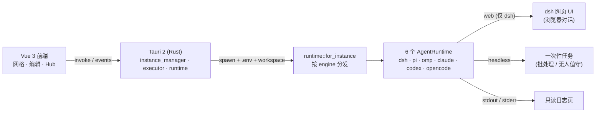

<div align="center">


# agentLauncher

**像 Prism Launcher 管理 Minecraft 实例一样，管理你的 AI Agent。**

[](LICENSE)
[](https://tauri.app)
[](https://vuejs.org)
[](https://www.rust-lang.org)
[](https://github.com/lildengzi/agentLauncher/releases)
[](https://github.com/lildengzi/agentLauncher/releases)
[](https://github.com/lildengzi/agentLauncher/actions)
[](CONTRIBUTING_zh.md)


**[English](README.md)**

</div>

---

## 📸 界面一览

| 实例面板 | 插件 Hub | 编辑实例 |
|----------|----------|----------|
|  |  |  |
| 网格卡片 / 右侧操作面板 / 状态栏 | 搜索 · 标签 · 评分推荐 | 常规 / 模型 / 提示词 |

---

> 六个引擎，一整排专属 Agent。

`agentLauncher` 是一个基于 **Prism Launcher 隔离哲学** 的 AI Agent 图形化启动器。它把每个 Agent 当成一个独立、隔离的「实例」来管理 —— 各自拥有独立的沙箱目录、模型、插件与密钥 —— 然后像点「启动」一样把它跑起来。每个实例用 `runtime.engine` 任选一个 CLI：`dsh` · `pi` · `omp` · `claude` · `codex` · `opencode`。

它只做**管理**，不插手对话：`dsh` 的 web 实例在 **dsh 自己的网页**里对话，其余 5 个引擎以 headless 一次性任务运行 —— 启动器只是那只手，负责把你选中的 CLI 跑起来（见[架构](docs/wiki/Architecture.md)）。

### ✨ 亮点

| | 能力 | 说明 |
|---|---|---|
| 🧱 | **实例隔离沙箱** | 每个 Agent 一个独立目录，`workspace/` 是它读写文件的安全根，互不越界。 |
| 🔐 | **独立凭据与 .env** | 密钥按实例隔离注入，永不进入前端；凭据文件保持 `0600`，本地优先。 |
| 🧩 | **插件 Hub** | 像逛整合包一样浏览、搜索、按标签推荐插件，为每个实例挑选能力。 |
| 🌐 | **一键启动到网页** | Web 实例自动起服务、抓端口、开浏览器，你在 dsh 自己的页面里对话。 |
| 📜 | **只读日志排障** | 流式 stdout 汇入只读日志页，方便回看工具调用与思维链，不抢对话。 |
| 🌱 | **基线克隆** | 调好一个基线，复制成前端 / 后端 / 批处理 Agent —— 只改 profile 与模型。 |

### 🧩 一个实例的解剖

一个 Agent = 一个目录。没有隐藏的全局状态，打开文件夹你看到的就是这个 Agent 的全部：

```text
~/.agentlauncher/instances/web-baseline/
├─ instance.json   # 元数据：名称 · 图标 · 分组 · 框架(engine) · provider · 模型
├─ AGENTS.md       # 该实例专属的 System Prompt 与行为守则
├─ mcp.json        # 启用的 MCP (Model Context Protocol) 插件配置
├─ .env            # 该实例专属的 API Keys 与环境变量（隔离注入）
├─ skills/         # 挂载的独立 Skill 工具包目录
├─ workspace/      # Agent 读写文件的安全沙箱根（会话历史也沉淀于此）
└─ logs/           # 历史输出与 Token 消耗审计日志
```

> `workspace/` 路径稳定，意味着会话历史与记忆天然沉淀在这里，跨次启动继续继承。

### 🚀 快速开始

**前置**：Rust 工具链 · Node + pnpm · **至少装一个 Agent CLI 并在 `PATH` 中** —— `dsh` · `pi` · `omp` · `claude` · `codex` · `opencode` 任选。启动器实时探测它们（编辑 ▸ 运行时里能看到哪些已装、装在哪）；各引擎的 API Key 各读各的，写进该实例的 `.env` 即可（dsh 例外，它读 `~/.dsh/.credentials.yaml`）。

```bash
pnpm install          # 安装前端依赖
pnpm tauri dev        # 开发模式，拉起桌面窗口
pnpm tauri build      # 打包桌面应用
```

1. **先装至少一个引擎** —— 启动器只是外壳，真正干活的是你选的那个 CLI。
2. **新建实例** —— 点「添加实例」，选一个框架（引擎）+ provider/模型，实例文件夹在 `~/.agentlauncher/` 下生成。
3. **启动** —— 按「启动」：dsh 的 web profile 会自动开浏览器在它自己的页面里对话，其余组合跑一次性任务并流式打日志；历史留在该实例的 `workspace/` 里。

> 📄 仓库内附带一份可直接用 GitHub Pages 托管的落地页：[`docs/landing.html`](docs/landing.html)。

### 🏗 架构 / How it works

轻量外壳，把**六个引擎**跑起来。**Tauri 2（Rust）** 负责管理子进程、文件沙箱与凭据；六个 `AgentRuntime` 适配器 `dsh` · `pi` · `omp` · `claude` · `codex` · `opencode` 全部并列在 `src-tauri/src/runtime/model.rs:1`，由 `runtime::for_instance`（`src-tauri/src/runtime/mod.rs:71`）按 `runtime.engine` 分发。`dsh` 是唯一支持 web 服务的引擎，其余五个只跑 headless 一次性任务。



- **运行形态由 引擎 + profile 推导**：仅 `dsh` 的 web 能力 profile（`bundles` 含 `@deepseek-ai/dsh-web-app`）会起 web 服务、抓端口、开浏览器；其余全部跑一次性任务（`-p` / `exec` / `run` 因引擎而异，见[实例解剖](docs/wiki/Instance-Anatomy.md#自由组合--框架--llm)矩阵）。
- **前后端契约**：`src/types.ts` 镜像 Rust 结构体，`src/lib/api.ts` 封装所有 `invoke` 命令与 `runtime-log` / `runtime-status` 事件。

### 🗺 路线图

- [x] 实例面板：网格卡片 / 分组 / 右侧操作面板 / 状态栏
- [x] 新建 / 编辑实例，真实拉起 dsh 并流式日志
- [x] Web 实例一键启动到 dsh 网页（运行形态从 profile 派生）
- [x] 插件 Hub：浏览 / 搜索 / 标签推荐
- [ ] Hub 内一键安装 / 卸载插件
- [ ] Headless 批处理 / 无人值守通道（已设计，暂缓）
- [ ] 实例导入 / 导出（recipe 配方）

### 🙏 致谢

- **[Prism Launcher](https://prismlauncher.org/)** —— 实例隔离哲学与界面布局的灵感来源（网格卡片、右侧面板、Hub 模态框）。
- **DeepSeek Harness (`dsh`) · pi · omp · Claude Code · Codex · opencode** —— 六个已接 CLI（`src-tauri/src/runtime/model.rs:22`），`dsh` 首选且唯一支持 web。

> ⚠️ 界面深受 Prism Launcher 启发，但 agentLauncher 是一个**独立项目**，与 Prism Launcher、Mojang、DeepSeek 官方无隶属关系。

### 🤝 参与贡献

见 [CONTRIBUTING_zh.md](CONTRIBUTING_zh.md) / [CONTRIBUTING.md](CONTRIBUTING.md)。欢迎通过 [Issue](https://github.com/lildengzi/agentLauncher/issues) 反馈 Bug 或提功能建议（已提供模板）。

### 📄 许可证

[MIT](LICENSE) © 2026 lildengzi