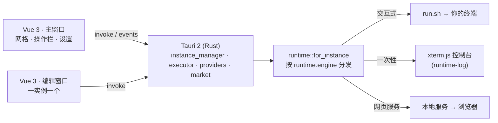

<div align="center">


# agentLauncher

**为隔离的 AI Agent 实例而生的通用启动器。**

[](LICENSE)
[](https://tauri.app)
[](https://vuejs.org)
[](https://www.rust-lang.org)
[](#-平台支持)
[](https://github.com/lildengzi/agentLauncher/releases)
[](https://github.com/lildengzi/agentLauncher/actions)
[](CONTRIBUTING_zh.md)


**[English](README.md)**

</div>

---

> 一个启动器，一整排专属 Agent。

`agentLauncher` 是一个面向 Agent CLI 的桌面启动器，沿用 **Prism Launcher 的隔离哲学**：每个 Agent
都是一个*实例* —— 自己的目录、模型、密钥、技能、MCP 服务与人设，一键 **启动**。

启动器从不插手对话本身。它探测你的 `PATH`、解析密钥、写好这一次运行的配置，然后把活交给你选的那个
CLI。目前内置六个引擎适配器：`dsh` · `pi` · `omp` · `claude` · `codex` · `opencode`。

## 📸 界面一览

| 实例面板 | 市场 | 编辑实例 |
|----------|------|----------|
|  |  |  |
| 分组图标网格 · 右侧操作栏 · 状态栏 | 插件 · 技能 · MCP，来自你自己的源列表 | 八个分区，独立的操作系统窗口 |

> ⚠️ 这三张图是 `v0.1.0` 时的样子。之后界面按 Prism Void 重绘过，插件 Hub 也换成了按实例打开的市场
> 对话框 —— 截图待重拍。

## ✨ 亮点

| | 能力 | 说明 |
|---|---|---|
| 🧱 | **一个 Agent = 一个目录** | 模型、人设、密钥、技能、MCP 服务、工作区与日志，全在 `~/.agentlauncher/instances/<id>/` 里。没有隐藏的全局状态。 |
| 🖥 | **交互式会话开在你自己的终端** | 六个引擎里有五个默认走这条路：启动器写一份 `run.sh`，拉起你的终端模拟器，你在自己熟悉的地方跟 CLI 对话。 |
| 📜 | **一次性任务流进 app** | 一次性运行把 stdout/stderr 汇入内置的 xterm.js 控制台，停止按钮就在旁边。 |
| 🌐 | **网页实例直接开浏览器** | 带网页能力的 `dsh` 档会在空闲端口起服务，启动器盯住 URL 并替你打开。 |
| 🔐 | **三层密钥** | 引擎自己的配置 → 启动器的共享密钥库 → 实例自己的 `.env`。密钥的值永不进入界面，只有指纹会。 |
| 🧰 | **会自己填满的服务商库** | 从任何 OpenAI 兼容端点拉一份真实模型列表、探测本机运行时（Ollama · LM Studio · vLLM · llama.cpp），或者直接从你已经装好的 Agent 里导入服务商与密钥。 |
| 🛒 | **去中心化市场** | 插件、技能、MCP 服务来自**你自己编辑**的源列表 —— HTTP 源、MCP Registry，或者一个本地投放目录 —— 抓取、归一化与缓存全在 Rust 里。 |
| 🪟 | **每个实例一个编辑窗口** | 八个分区，独立的操作系统窗口，可以两个 Agent 并排调。 |
| 🎨 | **13 套主题，中英双语** | 默认 Prism Void，另有 Catppuccin ×4、Dracula、Nord、Tokyo Night、Gruvbox、Solarized、One Dark、Rosé Pine、GitHub Light。全局 Alt 助记键。 |

## 🤖 支持的引擎

实时探测 `PATH` —— 不扫盘，也从不执行那个二进制去试。没装的引擎照样列出来并置灰，因为「为什么用不了」
是你该看见的事。

| 引擎 | `runtime.engine` | 服务商怎么选 | 网页服务 | 默认运行方式 |
|---|---|---|---|---|
| dsh (DeepSeek Harness) | `dsh` | 写进生成的 `model.patch.yml`，作为一条 route | ✅ | 一次性 |
| pi (pi-coding-agent) | `pi` | `--provider` / `--model` | — | 交互式 |
| omp (oh-my-pi) | `omp` | `--provider` / `--model` | — | 交互式 |
| Claude Code | `claude` | 没有 —— 只认 `ANTHROPIC_*` 环境变量 | — | 交互式 |
| Codex | `codex` | `-c model_provider=` / `-c model=` | — | 交互式 |
| opencode | `opencode` | `-m <provider>/<model>` | — | 交互式 |

**运行方式是怎么定的**（`src-tauri/src/runtime/mod.rs`）：

1. `dsh` 的档，其 `package.json` 的 `dsh.profile.bundles` 里含 `@deepseek-ai/dsh-web-app` → **网页服务**。
2. 否则看显式的 `runtime.mode`：`task` → **一次性**，`interactive` → **交互式**。
3. 否则用该引擎自己的默认 —— 上表最后一列。

新增一个引擎＝一个 `impl AgentRuntime` 加目录里一行，executor 一行不用改。

## 🧩 一个实例的解剖

一个 Agent = 一个目录。打开文件夹，你看到的就是这个 Agent 的全部：

```text
~/.agentlauncher/instances/web-baseline/
├─ instance.json      # 名称 · 图标 · 分组 · provider · 模型 · api_key_ref · runtime{engine,mode,env_policy,custom_bin} · profile
├─ AGENTS.md          # 该实例专属的 System Prompt 与行为守则 —— 界面里可直接编辑
├─ mcp.json           # 该实例的 MCP (Model Context Protocol) 服务 —— 界面里可直接编辑
├─ .env               # 该实例专属的 API Key 与环境变量（经界面写入后为 0600）
├─ skills/            # 只挂给这个实例的 Skill 工具包
├─ workspace/         # Agent 读写文件的安全沙箱根，会话历史沉淀于此
├─ logs/              # 历史输出与 Token 消耗审计
├─ model.patch.yml    # 每次带模型的 dsh 启动时生成
└─ run.sh             # 每次交互式启动时生成（0700）—— 这一次运行的环境，含解析出的密钥
```

`workspace/` 路径稳定，这正是会话历史与记忆能跨次启动继承的原因。最后两个文件每次启动都重写；
`run.sh` 永不回传前端，只有它的路径会出现在控制台的一行里。

## 🗄 启动器自己的目录

磁盘上不只有实例。根目录是 `0700`：

```text
~/.agentlauncher/
├─ config.json        # 主题 · 语言 · 默认 provider/模型 · 上次选中
├─ instgroups.json    # 侧栏叠加层：分组次序、折叠状态、组内次序
├─ providers.json     # 共享密钥库（0600）—— 服务商、Base URL、模型列表、带别名的多把钥匙
├─ sources.json       # 市场源列表
├─ sources/           # 内置 `local` 源读取的投放目录
├─ cache/market/      # 归一化后的源缓存，断网也能打开市场对话框
└─ instances/         # 一个实例一个目录
```

分组的**归属**写在实例自己身上，`instgroups.json` 只管次序与折叠 —— 所以手改过的 `instance.json`
不会被叠加层弄丢。

## 🔐 密钥

每个实例在**模型**页的「密钥存放」里选一层，启动时按这个顺序解析：

1. **`instance`** —— `instances/<id>/.env`，写入即 `0600`，只归这一个实例。
2. **`shared`** —— 启动器自己的库 `~/.agentlauncher/providers.json`（`0600`）。一个服务商可以放好几把
   带别名的钥匙；`api_key_ref` 要么钉住一把（`<provider>/<alias>`），要么在启用的那些之间轮询（`<provider>`）。
3. **`system`** —— 引擎自己的配置，一动不动。`dsh` 的就是 `~/.dsh/.credentials.yaml`（`0600`）。

代码真正守住的（不是「打算守住」）几条：

- **没有任何命令返回密钥明文。** 前端拿到的是 `{alias, enabled, fingerprint, has_value}`；指纹是前 4 位
  ＋`…`＋后 4 位，值太短就给八个圆点。「👁 可见」切换的是指纹↔圆点 —— 没有别的东西可露。
- `set_provider_key` 是密钥进磁盘的唯一入口。改别名会**故意**丢掉那把钥匙的值，而不是悄悄改绑。
- 拉模型列表（`fetch_provider_models`）在**后端内部**读密钥，非本机地址一律要求 `https`，不跟随重定向，
  且只能由用户逐个服务商手动触发。
- 服务商导入会读其他 Agent 的配置（`omp` · `pi` · `opencode` · `codex` · `dsh`），但只报 `has_key: bool`；
  真导入时值在磁盘之间搬，只回一个数量。
- 控制台只打变量**名**，不打值。

## 🛒 市场与数据源

没有中心化的 Hub。`sources.json` 是一份你在**设置 ▸ 数据源**里自己编辑的列表，内置三行：`dsh.market`
的 HTTP 源（插件＋技能）、一个 `local` 目录（`~/.agentlauncher/sources`，三类都收）、以及
[MCP Registry](https://registry.modelcontextprotocol.io)。

抓取、归一化、缓存、安装全在 Rust 里：协议白名单＋重定向后重新校验、超时、响应体积上限，然后由每个源
自己的适配器把它那套形状翻成统一的 `MarketItem` 词汇，落盘缓存，所以断网也能打开，并逐源报告状态与
新鲜度。安装走 `pnpm-profile` / `git-clone` / `mcp-config` 三条真路；其余一律降级成「把命令抄走自己
执行」，而不是给一个按下去必然失败的按钮。

源里的内容是第三方文本，就按第三方文本对待：一律当文本渲染（绝不 `v-html`），链接只经后端打开，需要的
环境变量只显示**名字**。

## 🚀 快速开始

**前置**：Rust 稳定版 · Node ≥ 22.13 ＋ pnpm 11（CI 就是这个组合）· **至少装一个 Agent CLI 并在 `PATH`
里** —— `dsh` · `pi` · `omp` · `claude` · `codex` · `opencode` 任选。

```bash
pnpm install                 # 安装前端依赖
pnpm tauri dev               # 开发模式，拉起桌面窗口
pnpm build                   # vue-tsc --noEmit && vite build
pnpm tauri build             # 打包桌面应用
cd src-tauri && cargo test   # 后端测试（18 个模块自带）
```

> 📦 这份 README 描述的全部内容都在 **`v0.2.0`** 里 —— 去
> [Releases](https://github.com/lildengzi/agentLauncher/releases) 拿现成包（deb · rpm · AppImage ·
> pacman · dmg · msi · nsis，x86_64 与 aarch64 都有），或者用上面的命令从源码构建。更早的 `v0.1.0`
> 二进制里没有市场、每实例编辑窗口、服务商密钥库和交互式会话。

1. **先装至少一个引擎。** 启动器只是外壳，真正干活的是你选的那个 CLI。
2. **新建实例。** 上面那张表选模型，下面那张表选 Agent；右侧的运行方式那一栏同时是过滤器（选「网页」
   就只剩带网页能力的引擎）。实例目录出现在 `~/.agentlauncher/instances/` 下。
3. **给它一把钥匙** —— 共享的去「设置 ▸ 模型与 API」，私有的去实例编辑窗口的「模型」页。本机运行时
   （Ollama 之类）不需要。
4. **启动。** 交互式会开你的终端；一次性任务流进控制台；网页档会打开浏览器。历史留在该实例的
   `workspace/` 里。

> 📄 仓库内附带一份可直接用 GitHub Pages 托管的落地页：[`docs/landing.html`](docs/landing.html)。

## 🖥 平台支持

| | 构建与运行 | 一次性 / 网页实例 | 交互式会话 |
|---|---|---|---|
| **Linux** | ✅ | ✅ | ✅ |
| **macOS** | ✅ | ✅ | ❌ 还没接 |
| **Windows** | ✅ | ✅ | ❌ 还没接 |

交互式要拉起一个终端模拟器，而目前那份探测名单只有 Linux 的：先看 `$TERMINAL`，再取第一个装了的
kitty · foot · alacritty · wezterm · ghostty · konsole · gnome-terminal · xfce4-terminal · terminator ·
tilix · urxvt · st · xterm 之类。由于交互式是六个引擎里五个的**默认**，在 macOS 与 Windows 上请把
`runtime.mode` 设成 `task`（或者用 `dsh` 的网页档），直到这个缺口补上。

## 🏗 架构 / How it works

一层套在**任意** Agent CLI 外面的轻壳。**Tauri 2（Rust）** 拿着子进程、文件沙箱、密钥和所有网络请求；
**Vue 3** 只管两个窗口。



- **两个窗口。** 启动器是 `index.html`；每个实例的编辑器是独立的操作系统窗口（`edit.html`，标签
  `edit-<id>`）—— 已经开着的那个不会再开第二个，而是聚焦过去。只有主窗口写 `config.json`，编辑窗口只读。
  主窗口在获得焦点时重读实例列表，因为编辑窗口会在它背后改 `instance.json`。
- **引擎适配器**在 `src-tauri/src/runtime/model.rs`，藏在 `AgentRuntime` trait 后面；目录在 `engines.rs`，
  子进程 `PATH` 策略在 `runtime/env.rs`，终端探测与 `run.sh` 生成在 `runtime/term.rs`，dsh 的 `$DSH_HOME`
  读取在 `runtime/dsh_home.rs`。`runtime/model_test.rs` 把六个引擎两种形态的 argv 全钉住了。
- **前后端契约。** `src/types.ts` 镜像 Rust 结构体；`src/lib/api.ts` 封装全部 45 个 `invoke` 命令和三个
  事件 —— `runtime-log` · `runtime-status` · `open-settings`。
- **实例编辑器**八个分区：常规 · 模型 · 运行时 · 扩展插件 · 技能 · MCP · 人设与契约 · 任务。插件那页对
  自己的作用域很诚实 —— `dsh` 的插件其实是档的 pnpm 依赖，因此是**共享的**；不支持插件的引擎会直说，
  而不是给你一个空列表。
- **设置**已实现外观、通用、模型与 API、数据源、关于；账户、远程服务、工具、代理列成「规划中」而不是
  藏起来。

## ⚠️ 已知限制

- 交互式会话仅限 Linux（见[平台支持](#-平台支持)）。
- 新建实例时铺出来的 `.env` 用的是默认 umask；等到经界面写入一把密钥之后才变成 `0600`。
- **导出实例**和顶栏的**账户**按钮是故意留的占位。
- CI 跑 `pnpm build` · `cargo check` · `clippy` · `cargo fmt`，但**不跑** `cargo test` —— 请本地跑。
  前端目前既没有测试框架也没有 ESLint 配置。
- 没有历史日志查看器：`logs/` 一直在攒，但控制台只显示当前这次运行。

## 🗺 路线图

- [x] Prism 式启动器：分组图标网格 · 右侧操作栏 · 状态栏 · Alt 助记键
- [x] 六个引擎实时探测 `PATH`；运行方式由 引擎 ＋ 档 推导
- [x] 交互式会话开在你自己的终端；一次性任务流进 app
- [x] 网页实例一键启动到浏览器
- [x] 每实例一个编辑窗口，八个分区全部落地
- [x] 应用级服务商与密钥库、实时模型列表、本机运行时探测、从已装 Agent 导入密钥
- [x] 去中心化市场源，带磁盘缓存与真实安装
- [x] 13 套主题，中英双语
- [ ] macOS 与 Windows 上的交互式会话
- [ ] 实例导入 / 导出（recipe 配方）
- [ ] 账户 · 远程服务 · 工具 · 代理 四个设置页
- [ ] 历史会话 / 日志浏览

## 📚 文档

[首页](docs/wiki/Home.md) · [快速上手](docs/wiki/Getting-Started.md) ·
[架构](docs/wiki/Architecture.md) · [配置](docs/wiki/Configuration.md) ·
[实例解剖](docs/wiki/Instance-Anatomy.md) · [启动器解剖](docs/wiki/Launcher-Anatomy.md) ·
[常见问题](docs/wiki/FAQ.md)

`docs/wiki/**` 一有改动，CI 会把这些页面同步到
[GitHub Wiki](https://github.com/lildengzi/agentLauncher/wiki)。

## 🙏 致谢

实例隔离与整个界面布局都以 [Prism Launcher](https://prismlauncher.org/) 为原型；agentLauncher 是独立
实现，与 Prism Launcher / Mojang / Anthropic / OpenAI / DeepSeek 均无隶属关系。品牌图标来自
[simple-icons](https://simpleicons.org)，字形来自 [Lucide](https://lucide.dev)，内置控制台是
[xterm.js](https://xtermjs.org)。

## 🤝 参与贡献

见 [CONTRIBUTING_zh.md](CONTRIBUTING_zh.md) / [CONTRIBUTING.md](CONTRIBUTING.md)。欢迎通过
[Issue](https://github.com/lildengzi/agentLauncher/issues) 反馈 Bug 或提功能建议（已提供模板）。

## 📄 许可证

[MIT](LICENSE) © 2026 lildengzi
