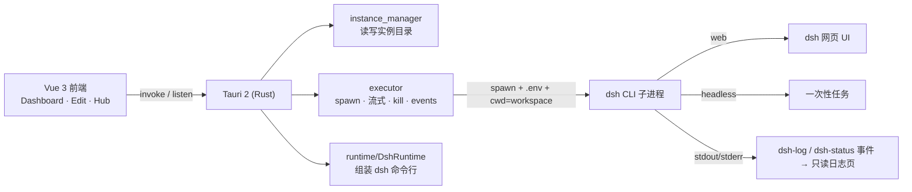

# Architecture · 架构

> A light Tauri shell that runs the dsh engine.

## 全景 · Overview

## 职责边界 · The one seam

- **`AgentRuntime` trait** = 唯一与「哪种 Agent」相关的接缝：负责**命令行组装**（`DshRuntime` 实现 dsh 的那套）。
- **`executor`** = 通用宿主：负责 spawn / 流式读取 / kill / 发事件，与具体 Agent 无关。
- 之所以这么切，是为了将来接入别的 Agent 引擎时，只需新增一个 `AgentRuntime` 实现。

## 关键文件 · Key files

| 文件 | 职责 |
|---|---|
| `src-tauri/src/instance_manager.rs` | 遍历 / 读写 `~/.dsh-launcher/instances/`，返回卡片数据 |
| `src-tauri/src/dsh_config.rs` | 解析 profile；`profile_is_web_capable()` 是运行形态的唯一判据 |
| `src-tauri/src/runtime/dsh.rs` | `DshRuntime::build_command` 组装 `dsh` 命令行 |
| `src-tauri/src/executor.rs` | spawn / 流式 / kill；扫描 stdout 里的 URL 并用 opener 打开 |
| `src/types.ts` | 镜像 Rust 结构体的前端类型 |
| `src/lib/api.ts` | 封装所有 `invoke` 命令与 `dsh-log` / `dsh-status` 事件 |

## 运行时事件 · Events

- **`dsh-log`**：子进程 stdout/stderr 逐行流式推送，喂给只读日志页。
- **`dsh-status`**：状态变化（`running` / `exited` / `error`）；web 实例在 `running` 时携带抓到的 `url`。

## 前后端契约 · Contract

`src/types.ts` 与 Rust 结构体一一对应，改一边要同步另一边。所有跨进程调用都经过 `src/lib/api.ts` 收口，便于排查。
