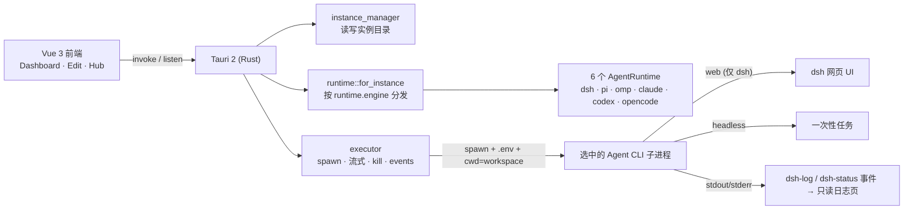

# Architecture · 架构

> A light Tauri shell that runs any of six agent CLIs.

## 全景 · Overview

## 职责边界 · The one seam

- **`AgentRuntime` trait** = 唯一与「哪种 Agent」相关的接缝：负责**命令行组装**（`build_command`）与**运行形态判据**（`is_serve`，默认 `false`，仅 `DshRuntime` 按 profile 覆盖）。现有 **6 个实现**：`dsh`/`pi`/`omp`/`claude`/`codex`/`opencode`，全部并列在 `runtime/model.rs` 一个文件里——每个引擎只差「二进制名 + 非交互开关 + provider/model 怎么注入」这几行，并排着看就是一张矩阵，一个引擎一个文件反而把它藏起来了。
- **`runtime::for_instance`** 按 `instance.runtime.engine` 分发到对应实现（缺失/空/未知 → `DshRuntime`，向后兼容）。
- **`executor`** = 通用宿主：负责 spawn / 流式读取 / kill / 发事件，与具体 Agent 无关；web/headless 的分叉现由 `agent.is_serve(&inst)` 决定，executor 不再直接问 dsh。
- **`engines::detect_engines`** = 宿主能力探测：对 6 个引擎实时 `which`（复用 `runtime/env.rs` 的 PATH），**不落盘缓存**。
- 之所以这么切，是为了将来接入别的 Agent 引擎时，只需在 `runtime/model.rs` 新增一个 `AgentRuntime` 实现 + 注册表一行 + `model_test.rs` 几行（漏写测试行会直接编译失败）。

## 关键文件 · Key files

| 文件 | 职责 |
|---|---|
| `src-tauri/src/instance_manager.rs` | 遍历 / 读写 `~/.agentlauncher/instances/`，返回卡片数据 |
| `src-tauri/src/launcher_config.rs` | 启动器契约：`config.json` / `instgroups.json` 的读写命令，缺失即回退默认 |
| `src-tauri/src/dsh_config.rs` | 解析 profile；`profile_is_web_capable()` 供 `DshRuntime::is_serve` 判断运行形态 |
| `src-tauri/src/engines.rs` | 引擎注册表 `known_engines()` + `detect_engines` 实时探测宿主已装 CLI（不缓存） |
| `src-tauri/src/runtime/mod.rs` | `AgentRuntime` trait + `for_instance` 按 `runtime.engine` 分发 |
| `src-tauri/src/runtime/model.rs` | 六个引擎适配器**同一个文件**：`dsh`（含 `is_serve` 按 profile 判 web、写 `model.patch.yml`）+ `pi`/`omp`/`claude`/`codex`/`opencode` 的 headless 命令行组装（见 [Instance Anatomy](Instance-Anatomy#自由组合--框架--llm) 矩阵）；均支持 `custom_bin` 覆盖 |
| `src-tauri/src/runtime/env.rs` | 按实例 `runtime.env_policy` 解析子进程 PATH（autodetect 探登录 shell / isolated 最小化），宿主无关 |
| `src-tauri/src/runtime/model_test.rs` | 「框架 × LLM」测试总表：六引擎 argv 矩阵、分发、真实建实例回读再组命令、已装引擎 `--version` 存活探测 |
| `src-tauri/src/test_support.rs` | 仅 `cfg(test)`：跨模块共享的 `HOME` / `DSH_HOME` 锁与临时目录、env 守卫 |
| `src-tauri/src/executor.rs` | spawn / 流式 / kill；spawn 前设子进程 PATH；扫描 stdout 里的 URL 并用 opener 打开 |
| `src/types.ts` | 镜像 Rust 结构体的前端类型 |
| `src/lib/api.ts` | 封装所有 `invoke` 命令与 `dsh-log` / `dsh-status` 事件 |

## 运行时事件 · Events

- **`dsh-log`**：子进程 stdout/stderr 逐行流式推送，喂给只读日志页。
- **`dsh-status`**：状态变化（`running` / `exited` / `error`）；web 实例在 `running` 时携带抓到的 `url`。

## 前后端契约 · Contract

`src/types.ts` 与 Rust 结构体一一对应，改一边要同步另一边。所有跨进程调用都经过 `src/lib/api.ts` 收口，便于排查。契约分两层，都**由后端拥有、落盘为真相、带版本号**：

- **实例契约**（`instance_manager.rs` ↔ `Instance`）：每个 Agent 一个目录，`instance.json` 带 `schema_version`。见 [Instance Anatomy](Instance-Anatomy)。
- **启动器契约**（`launcher_config.rs` ↔ `LauncherConfig` / `InstGroups`）：启动器自身的 UI 偏好、全局默认值、会话状态、侧栏分组，落在 `~/.agentlauncher/{config.json, instgroups.json}`，各带 `format_version`。见 [Launcher Anatomy](Launcher-Anatomy)。

> 密钥不属于任何契约文件——凭据只归运行时 `~/.dsh/.credentials.yaml`。
